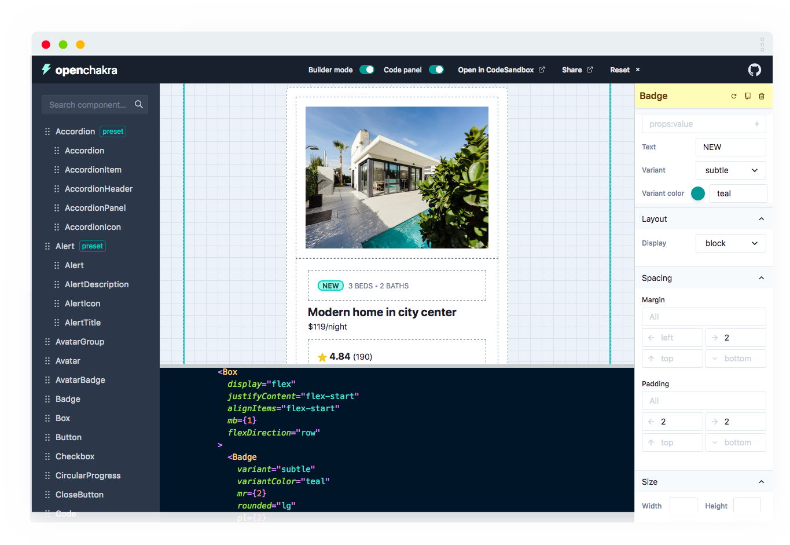

  
  <h3>Visual Editor for Chakra UI</h3>

OpenChakra is a visual editor for the best component library in town: [Chakra UI](https://chakra-ui.com) 🤗. Quickly draft components with the simple drag and drop UI.

## Features

- 🎨 Drag and drop [Chakra UI](https://chakra-ui.com/getting-started) components
- 💅 Preset components
- 👀 Live props editing and styling
- ⚛️ Production-ready code
- 🎈 CodeSandbox export
- 🔮 Undo/redo edit
- 💽 Localstorage sync

## Getting started

### Builder mode

The Builder mode adds extra padding/border to ease components selection (like containers).

> 💡Toggle the Builder mode with the `b` shortcut

### Code panel

Toggle the code panel for viewing the JSX/React code of your components. You can even export your code directly to CodeSandbox!

> 💡Toggle the Code panel with the `c` shortcut

### Components panel

Drag any component from the left hand panel into this editor. Then start interacting with them.
You can drag a preset: it's a group of components (like Alert). Just drop a preset to easily setup a complex component!

### Inspector

**Update props & style**

On the right hand-side, you can find the inspectror panel. You will find the tools to edit the component's props and style.

**Delete, reset and documentation**

Reach the yellow bar on the top to delete, reset and access the Chakra documentation of each component.

**Sort components**

By clicking on a component containing children, you will see a Children panel appearing on the right. It enables sorting the children.

### Editor Shortcuts

| Shortcut         | Description               |
| ---------------- | ------------------------- |
| `cmd+Z` `ctrl+Z` | Undo last action          |
| `cmd+Y` `ctrl+y` | Redo action               |
| `del`            | Delete selected component |
| `c`              | Toggle Code panel         |
| `b`              | Toggle Builder mode       |
| `p`              | Select parent component   |
| `Esc`            | Unselect component        |

## Roadmap

- More Chakra UI components integration
- Components copy
- Props panel improvements
- Code generation improvements
- Dark mode support
- Custom presets
- Custom theme
- Handle PseudoBox state (hover, active…)
- Fix bugs 🧨
- Support other UI (Material, Reakit...)
